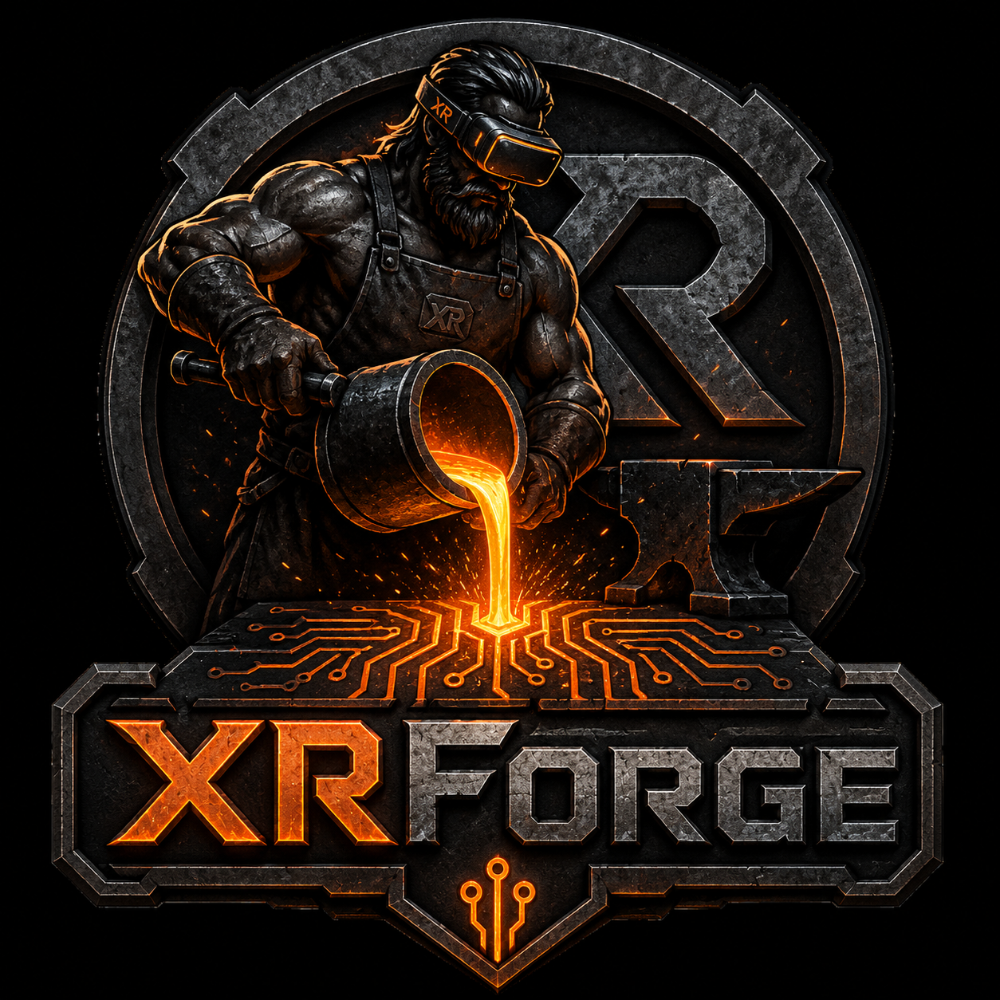
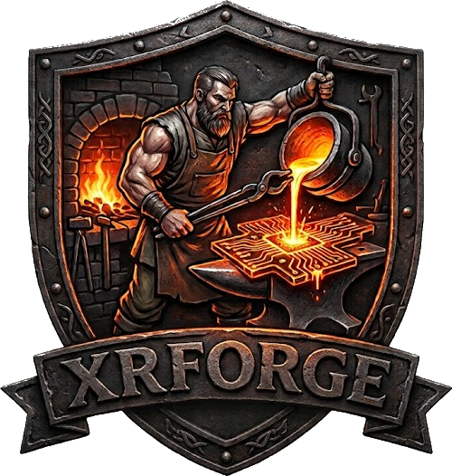

<p align="center">
  
</p>

# XRForge

Current version: `0.2.1`

XRForge is an open-source XR hardware compatibility project focused on bringing
VR, AR, and MR headsets and controllers to Linux through open standards such as
OpenXR and Monado, with future cross-platform potential.

The current development target is Windows Mixed Reality compatible XR hardware.
The HP Reverb and WMR motion controllers are the first validated devices, not
the limit of the project.

## Install / Run

To install and run the current WMR-compatible XR device SteamVR workflow, run:

```bash
./start.sh
```

Run it as your normal desktop user, not with `sudo`. SteamVR driver
registration and SteamVR settings are user-account configuration.

That is the normal path. The script will:

- verify required command-line tools are available
- configure the local Monado build when the checkout is new or has moved
- build the local Monado SteamVR target with `ninja`
- make the SteamVR driver load its bundled helper libraries
- confirm the local OpenXR runtime manifest exists
- confirm the SteamVR Monado driver exists
- export `XR_RUNTIME_JSON` for OpenXR clients launched from that shell
- print the local SteamVR driver path
- check whether WMR-compatible XR USB devices are visible
- check the configured controller Bluetooth pairing/connection state
- reconnect configured paired/trusted Bluetooth controllers when needed
- show active Bluetooth controller links when `hcitool` is available
- under X11, detect the headset display output, mark it `non-desktop`, and
  remove it from the desktop layout before SteamVR takes direct control
- register the local Monado SteamVR driver with SteamVR
- launch SteamVR
- report the expected Monado process model

The working stack is:

```text
WMR-compatible XR headset/controllers
        |
Monado SteamVR driver
        |
SteamVR
        |
VR applications
```

For this SteamVR driver workflow, Monado is normally loaded through
`driver_monado.so` inside SteamVR, typically under `vrserver`. A separate
long-running `monado-service` process is not expected.

The full manual setup process for the first validated device is documented in
`XRForge_HP_Reverb_Linux_Setup_Guide.md`.

`start.sh` computes paths from the checkout it is running in. The generated
Monado build cache and SteamVR driver registration may contain absolute paths on
each machine, but those are local runtime/configuration details and should not be
committed as project source.

## Current Status

The project foundation is working:

- XR headset display
- USB device communication
- Head tracking
- SteamVR startup
- Monado SteamVR integration
- WMR controller Bluetooth pairing
- Dual controller connection
- Controller buttons and triggers
- Controller IMU orientation fallback

## Immediate Focus

The remaining high-priority issue is WMR controller optical position tracking.
Controller Bluetooth, IMU orientation, trigger input, and laser pointer output
are present, but true WMR camera/LED 6DoF controller tracking is still under
debug. When optical samples are not available, XRForge uses a simulated 3DoF
fallback pose.

Primary investigation area:

```text
monado-source/src/xrt/drivers/wmr/wmr_controller_base.c
```

Function:

```c
wmr_controller_base_get_tracked_pose()
```

The goal is to feed WMR controller camera LED observations into Monado's
constellation tracker without breaking grip pose, IMU orientation, button
mappings, or trigger input.

## Repository Layout

- `monado-source/` - Monado source tree used for XR runtime development.
- `start.sh` - WMR-compatible XR SteamVR session starter.
- `XRForge_HP_Reverb_Linux_Setup_Guide.md` - documented manual setup process
  for the first validated WMR-compatible XR device.
- `XRForge_Monado_Handoff.md` - technical handoff and current investigation notes.
- `TODO.md` - project checklist and near-term work items.
- `assets/images/` - XRForge project image assets.

## Upstream Runtime

XRForge builds on Monado, an open-source XR runtime and OpenXR implementation.
See `monado-source/README.md` and `monado-source/CONTRIBUTING.md` for upstream
build, contribution, and licensing guidance.

## Optional Controls

These options are for debugging, automation, or LLM-assisted workflows. Most
users should just run `./start.sh`.

```bash
./start.sh --check-only
./start.sh --skip-build
./start.sh --no-register-steamvr
./start.sh --no-launch-steamvr
./start.sh --no-bluetooth
./start.sh --no-bluetooth-connect
./start.sh --no-x11-non-desktop
./start.sh --wmr-3dof
```

The explicit positive forms are also accepted for scripted use:

```bash
./start.sh --register-steamvr
./start.sh --launch-steamvr
```

`runonce.sh` is kept as a compatibility wrapper for older instructions and
forwards to `start.sh`.

## Troubleshooting

If SteamVR reaches `VR_Init successful` but then reports `Failed to connect to
headset display (496)`, check `~/.local/share/Steam/logs/vrcompositor.txt`.
Messages such as `Failed to acquire xlib display` and
`VRInitError_Compositor_CannotDRMLeaseDisplay` mean SteamVR loaded Monado and
found the XR device, but the compositor could not take direct-mode control of
the headset display.

That failure is separate from Monado service startup and separate from headset
USB detection. It usually points at the Linux desktop/display stack, GPU driver,
DRM leasing, direct mode, or display-session configuration.

If the headset panels light up but show no image, the headset display has
powered on but SteamVR has not successfully taken direct-mode control. On X11,
confirm the headset output is marked `non-desktop`:

```bash
xrandr --verbose
```

`start.sh` does this automatically by detecting the headset-like output, caching
that RandR output name locally, running `xrandr --output <output> --set
non-desktop 1`, and then running `xrandr --output <output> --off` so the headset
is not part of the normal desktop layout. If automatic detection picks the wrong
output, set `XRFORGE_X11_HEADSET_OUTPUT` to the desired RandR output name.

WMR controller position uses optical camera/LED tracking when Monado produces
constellation samples. If no optical samples are available, XRForge falls back
to a simulated 3DoF controller pose. The fallback offset follows the HMD
position, but it does not rotate around the HMD when you look left or right.
Default fallback offset:

```bash
WMR_CONTROLLER_FALLBACK_X=0.14
WMR_CONTROLLER_FALLBACK_Y=-0.28
WMR_CONTROLLER_FALLBACK_Z=-0.10
STEAMVR_EMULATE_INDEX_CONTROLLER=true
```

If controllers appear too high, low, near, or far in SteamVR, tune the fallback
offset:

```bash
WMR_CONTROLLER_FALLBACK_Y=-0.24 WMR_CONTROLLER_FALLBACK_Z=-0.06 ./start.sh
```

If the fallback laser points left or right of the target, tune the aim yaw:

```bash
WMR_CONTROLLER_AIM_YAW_DEGREES=65 ./start.sh
```

Lower values rotate the fallback laser clockwise/right. Higher values rotate it
counterclockwise/left. Use `WMR_CONTROLLER_AIM_YAW_DEGREES_LEFT` or
`WMR_CONTROLLER_AIM_YAW_DEGREES_RIGHT` when only one hand is off.

XRForge defaults `STEAMVR_EMULATE_INDEX_CONTROLLER=true` so SteamVR gets known
Index controller render models and legacy bindings instead of falling back to a
generic locator-style controller visualization.

Optical controller LED detection can be tuned with:

```bash
WMR_CONTROLLER_BLOB_PIXEL_THRESHOLD=220 \
WMR_CONTROLLER_BLOB_REQUIRED_THRESHOLD=240 \
WMR_CONTROLLER_BLOB_MAX_WIDTH=12 \
WMR_CONTROLLER_BLOB_ALLOW_SINGLE_PIXEL=false \
WMR_CONTROLLER_USE_SLAM_FRAMES=true \
WMR_CONTROLLER_MAX_BRIGHT_FRACTION=0.08 \
WMR_CONTROLLER_MIN_BRIGHT_PIXELS=0 \
WMR_CONTROLLER_MAX_BRIGHT_PIXELS=0 \
./start.sh
```

If a controller LED ring turns off when the driver initializes, test startup
without controller reinit commands. XRForge now defaults both off for HP Reverb
controller testing:

```bash
WMR_CONTROLLER_ZERO_COMMAND=false \
WMR_CONTROLLER_TASK_RESTART=false ./start.sh
```

XRForge writes a centered SteamVR chaperone before launch so room-scale apps do
not inherit an old or tiny play area from a previous SteamVR Room Setup run. The
default is a `3.0m x 3.0m` standing play area centered on the Monado tracking
origin:

```bash
XRFORGE_STEAMVR_CHAPERONE=true
XRFORGE_STEAMVR_PLAY_AREA=3.0
XRFORGE_STEAMVR_STANDING_X/Y/Z/YAW=preserve-existing
```

The first existing SteamVR chaperone file is backed up as
`~/.local/share/Steam/config/chaperone_info.vrchap.xrforge-backup`. Set
`XRFORGE_STEAMVR_CHAPERONE=false` to leave SteamVR's room setup untouched.
XRForge preserves the standing transform from that backup by default and only
expands the play-area bounds.

Optical pose samples are quality-gated before they replace fallback position:

```bash
WMR_CONTROLLER_MIN_MATCHED_BLOBS=4
WMR_CONTROLLER_MAX_REPROJECTION_ERROR=35
WMR_CONTROLLER_MAX_POSITION_JUMP=0.18
WMR_CONTROLLER_OPTICAL_POSITION_ALPHA=0.25
WMR_CONTROLLER_REACQUIRE_AFTER_REJECTS=8
```

To capture the raw controller camera images that are feeding the blob detector:

```bash
WMR_CONTROLLER_DUMP_FRAMES=12 ./start.sh
```

This skips the startup frames, then writes sampled controller camera frames to
`/tmp/xrforge-wmr-controller-cam*.pgm`. Use
`WMR_CONTROLLER_DUMP_SKIP_FRAMES` and `WMR_CONTROLLER_DUMP_INTERVAL` to change
when frames are captured. The SteamVR Monado driver usually logs through
SteamVR after launch, so the most useful driver log is normally
`~/.local/share/Steam/logs/vrstartup-linux.txt`, not only the shell output.

While WMR optical orientation is still unstable, optical samples are used for
controller position only. Controller orientation remains IMU-driven to avoid
erratic roll. Accepted optical positions are smoothed and pushed without linear
velocity estimation to avoid drift from intermittent bad samples.

Useful controller-tracking diagnostics in the `./start.sh` terminal output:

```text
controller cam0 frame #... max=... above_pixel=... above_required=...
controller cam0 blobs #...: N
WMR optical controller sample #...
Rejected WMR optical controller sample #...
```

If the world rolls as if the physical headset is being rolled, test the
IMU-only WMR path:

```bash
./start.sh --wmr-3dof
```

If 3DoF mode stops the rolling, the display path is working and the remaining
bug is in WMR SLAM/Basalt HMD pose correction.

<p align="center">
  
</p>

<p align="center">
  Copyright 2026 Pseudo Science Fiction
</p>
